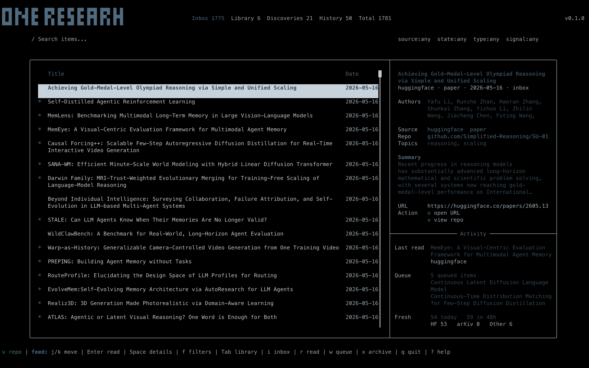

# trench

A terminal UI for following AI research — aggregates arXiv, HuggingFace daily papers, and blog feeds into a single keyboard-driven interface.



## Features

- Aggregates arXiv (cs.LG, cs.AI, stat.ML and more), HuggingFace daily papers, OpenReview, optional CORE, OpenAI blog, DeepMind blog, BAIR blog, MIT News AI, Import AI newsletter, and any custom RSS/Atom feed
- **Subject Browser** — navigate arXiv's full taxonomy (8 groups, ~155 categories) and promote any subject into your daily feed with one keystroke
- Workflow states per item: Inbox, Queued, Deep Read, Archived — persisted across sessions
- Full-text reader: opens papers and articles inline without leaving the TUI
- Split-view reader: primary feed alongside a persistent reader pane, independently scrollable
- Floating reader popup: open a paper in a centered overlay without leaving the feed
- GitHub repository browser: browse and read linked repos from the details panel
- Notes panel: per-session markdown notes alongside any pane
- Chat panel: ask questions about the selected item using Claude or OpenAI
- AI source discovery: describe a topic and trench finds relevant arXiv categories and RSS feeds to add
- Semantic Scholar enrichment: citation counts and fields of study (7-day cache)
- Runtime themes: Dark, Light, and AMOLED — switchable from the Settings screen
- Fast startup: cached feed loaded immediately; network fetches run in the background
- No async runtime — plain threads and blocking I/O throughout

## Architecture

Data flows in one direction: external sources are fetched on a background
thread, merged and de-duplicated into application state, persisted, and drawn.
The cache and the workflow-state store are **siblings** — both load at startup
so the TUI paints from disk before any network call returns.

```
        arXiv · HuggingFace · OpenReview · CORE · RSS/Atom
                              │
                  ┌───────────▼───────────┐
                  │       Ingestion        │  Source + EnrichmentSource
                  │   (background thread)   │  registries, grouped by host,
                  └───────────┬───────────┘  streamed over std::sync::mpsc
                              │  FetchMessage::Items
                  ┌───────────▼───────────┐
                  │          App           │  process_incoming(): URL- and
                  │     (merge + sort)      │  arXiv-ID dedup, sort by date
                  └─────┬─────────────┬─────┘
            ┌───────────┘             └───────────┐
      ┌─────▼──────┐                       ┌───────▼───────┐
      │   Cache    │                       │  State Store  │  workflow states
      │ cache.json │                       │  state.json   │  (Inbox/Queued/…),
      └────────────┘                       └───────────────┘  keyed by URL
                              │
                  ┌───────────▼───────────┐
                  │       TUI (draw)       │  single draw(frame, app); ratatui
                  └───────────┬───────────┘
              ┌───────┬───────┴───────┬───────┐
          ┌───▼──┐ ┌──▼───┐      ┌────▼───┐ ┌─▼────┐
          │ Feed │ │Reader│      │ Notes  │ │ Chat │
          └──────┘ └──────┘      └────────┘ └──────┘
```

The codebase is evolving through small, documented architectural slices: each
extracts a seam (ingestion, store, discovery, frame layout, …), records the
rationale in an ADR, and locks the boundary with a tripwire script. The
load-bearing references are:

- [`docs/CONTEXT.md`](docs/CONTEXT.md) — domain vocabulary (FeedItem, Workspace,
  the per-pane model) and architecture boundaries.
- [`docs/adr/`](docs/adr/) — accepted architecture decisions, including the
  per-pane **render purification** refactor (separating state updates from the
  pure render path) and the ingestion, store, and search seams.

## Installation

### From source

Requires Rust 1.88 or later.

```sh
git clone https://github.com/VictoryChianumba/trench
cd trench
cargo build -p trench --release
# Binary is at target/release/trench
```

To install into `~/.cargo/bin`:

```sh
cargo install --path trench
```

### Requirements

- Rust 1.88+
- Optional: Claude API key (`claude_api_key` in config) for AI chat and source discovery
- Optional: OpenAI API key (`openai_api_key` in config) for AI chat with GPT models
- Optional: GitHub token (`github_token` in config) for the repository browser
- Optional: Semantic Scholar API key (`semantic_scholar_key` in config) for citation enrichment
- Optional: CORE API key (`core_api_key` in config) to enable CORE ingestion
- Optional: Perplexity API key (`perplexity_api_key` in config) for discovery web search

## Configuration

Config file: `~/.config/trench/config.json`

The file is created automatically on first run. All fields are optional.

```json
{
  "github_token": "ghp_...",
  "semantic_scholar_key": "...",
  "claude_api_key": "sk-ant-...",
  "openai_api_key": "sk-...",
  "core_api_key": "...",
  "perplexity_api_key": "...",
  "default_chat_provider": "claude",
  "sources": {
    "arxiv_categories": ["cs.LG", "cs.AI", "stat.ML"],
    "enabled_sources": {
      "huggingface": true,
      "openai": true,
      "deepmind": true,
      "import_ai": true,
      "bair": true,
      "mit_news_ai": true,
      "openreview": true,
      "core": false
    },
    "custom_feeds": []
  }
}
```

| Field | Description |
|---|---|
| `github_token` | Personal access token for the GitHub repository browser |
| `semantic_scholar_key` | API key for citation enrichment (unauthenticated requests are rate-limited) |
| `claude_api_key` | Anthropic API key for Claude chat and AI source discovery |
| `openai_api_key` | OpenAI API key for GPT chat |
| `core_api_key` | CORE API key; CORE stays disabled by default until configured and enabled |
| `perplexity_api_key` | Optional web-search key used by the discovery agent |
| `default_chat_provider` | `"claude"` or `"openai"` |
| `sources.arxiv_categories` | arXiv category codes to fetch (e.g. `"cs.CL"`, `"cs.CV"`) |
| `sources.enabled_sources` | Toggle predefined sources on or off |
| `sources.custom_feeds` | List of custom RSS/Atom feeds (see Sources below) |

Settings can also be edited from within the TUI via `Ldr+S` (Settings screen), including theme selection.

Runtime data files:

| Path | Contents |
|---|---|
| `~/.config/trench/config.json` | Configuration |
| `~/.config/trench/state.json` | Persisted workflow states (keyed by URL) |
| `~/.config/trench/cache.json` | Last fetched feed items |
| `~/.config/trench/enrichment_cache.json` | Semantic Scholar data (7-day TTL) |
| `~/.config/trench/trench.log` | Log file (set `TRENCH_DEBUG_LOG=1` for verbose output) |

## Sources

### Default sources

| Source | Type |
|---|---|
| arXiv | Atom API — cs.LG, cs.AI, stat.ML (configurable) |
| HuggingFace daily papers | Scraped; upvote counts included |
| OpenAI blog | RSS |
| DeepMind blog | RSS |
| BAIR blog | RSS |
| MIT News AI | RSS |
| Import AI | Substack RSS |
| OpenReview | API |
| CORE | API, disabled by default and requires `core_api_key` |

### Adding sources

**arXiv categories** — switch to the Browse tab (`Tab` cycles to it), use the right-side subject rail with `h`/`l`/`j`/`k`, and press `p` on any category to add it to your daily feed. `Enter` on a category loads recent papers into the Browse feed without promoting it. Promoted categories show a `★` marker; press `p` again to un-promote.

**AI source discovery** — switch to the Discoveries tab (`Ldr+d`), press `/`, and describe a research topic. trench will query the model and return a list of relevant arXiv categories and RSS feeds you can add with a single keystroke.

**Custom RSS/Atom feeds** — go to Settings (`Ldr+S`) → Sources → Add feed. Paste the URL; trench will auto-detect whether it is an arXiv category, a Substack blog, or a generic RSS/Atom feed. Custom feeds are stored in `config.json` under `sources.custom_feeds`.

To add a feed manually, append an entry to `custom_feeds`:

```json
{
  "url": "https://example.com/feed.xml",
  "name": "example",
  "feed_type": "rss"
}
```

## Keybindings

The leader key is `Ctrl+T` (shown as `Ldr` below).

### Feed navigation

| Key | Action |
|---|---|
| `j` / `k` | Move down / up |
| `g` / `G` | Jump to top / bottom |
| `/` | Search the feed (fuzzy, relevance-ranked) |
| `Enter` | Open item in reader |
| `o` | Open URL in browser |
| `r` | Refresh all sources |
| `Tab` | Cycle focus between open panes |

### Search

Press `/` and type. Search is fuzzy (typo-tolerant) and **relevance-ranked** — the
best match is surfaced first, rather than just filtering the list in place. A title
hit outranks an author hit outranks an abstract hit.

Plain words match across title, authors, and abstract. Field prefixes restrict a
term to one field, and multiple terms are conjunctive (all must match):

| Query | Matches |
|---|---|
| `attention is all you need` | any item whose title/author/abstract fuzzily contains all terms |
| `ti:diffusion` | `diffusion` in the title only (`title:` also works) |
| `abs:reinforcement` | `reinforcement` in the abstract (`abstract:` also works) |
| `author:hinton` | an author named Hinton (`au:` also works) |
| `author:"Yann LeCun"` | quotes group a value containing spaces |
| `cat:cs.LG` | items in the arXiv category cs.LG (`category:` also works) |
| `cat:cs` | items in any cs.* category (archive-level match) |
| `year:2024` | published in 2024 |
| `year:2020-2024` | published in the inclusive range |
| `year:>=2023` | published in 2023 or later (`>`, `<`, `<=` also work) |
| `au:vaswani year:2017 attention` | combine field terms, a year, and free text |

### Workflow states

| Key | State |
|---|---|
| `i` | Inbox |
| `q` | Queued |
| `w` | Deep Read |
| `x` | Archived |

### Subject Browser (Browse tab)

`Tab` cycles tabs in the order **Inbox → Browse → Library → Discoveries →
History → Inbox**. Default landing tab is Inbox (the curated feed);
Browse is the firehose surface for arXiv's full taxonomy.

The Browse tab has a narrow right rail showing one taxonomy level at a
time and the regular feed table on the left with a leading **Subject**
column. The breadcrumb above the rail shows your current drill path
(e.g. `Mathematics › math`).

| Key | Action |
|---|---|
| `l` / `→` from the feed | Focus the right-side subject rail |
| `j` / `k` | Move the rail cursor |
| `l` / `→` in the rail | Drill into the highlighted Group / Archive; from a Category return focus to the feed |
| `Enter` | Drill into a Group / Archive, or load recent papers when on a Category |
| `h` / `←` / `Esc` / `Backspace` | Drill back one level; from the rail root return focus to the feed |
| `p` | Promote / un-promote the selected Category — toggles membership in your daily feed. `★` marks promoted categories. |
| `x` / `F` | Quick-toggle subject-follow — when on, the feed area narrows to the rail's current drill point |

The rail footer always shows the follow state. Pressing `f` swaps the
right rail to the filter panel until `f`, `Tab`, or `Esc` closes it.
Promotions take effect on the next manual refresh
(`R`). Browse-fetched papers merge into the global cache (dedup +
workflow state preserved) but only appear in Inbox if their category
is promoted.

Browse loads papers a page at a time from arXiv. With subject-follow
on, landing the rail cursor on a Category auto-loads its first page
after a brief pause — no `Enter` needed (`Enter` still loads
immediately, and is the way to load with follow off). Scrolling toward
the bottom of a category's results fetches the next page, so the list
deepens as you read rather than stopping at the first ~50 papers. A
quiet `loading…` line shows at the foot of the feed while a page is
being fetched, and a `caught up — N papers` marker appears once you
reach the archive's oldest entries.

### Sort modes

Open the filter pane with `f` to access four mutually-exclusive sort
modes that apply across every tab:

| Mode | Behaviour |
|---|---|
| `Dated` | Newest first by `published_at` (default). |
| `Random` | Deterministic shuffle keyed off a per-session seed. Selecting Random again re-shuffles. |
| `Popular` | Highest `upvote_count` first. arXiv items without HuggingFace upvotes / Semantic Scholar citations sort to the bottom. |
| `Trending` | Items from the last 14 days only, sorted by `upvote_count`. Older items are filtered out. |

Sort modes are session-only — they reset to `Dated` on next launch so
re-opening trench never surprises you with a stale random shuffle.

### Leader bindings (`Ctrl+T` then key)

| Binding | Action |
|---|---|
| `Ldr+d` | Toggle between Inbox and Discoveries tabs |
| `Ldr+v` | Toggle split-view secondary reader pane |
| `Ldr+Enter` | Open selected item in floating popup reader |
| `Ldr+c` | Toggle Chat pane |
| `Ldr+n` | Toggle Notes pane |
| `Ldr+S` | Open Settings screen |
| `Ldr+?` | Open help screen |
| `Ldr+q` | Quit |

### Reader mode

| Key | Action |
|---|---|
| `j` / `k` | Scroll down / up one line |
| `d` / `u` | Scroll down / up half page |
| `f` / `b` | Scroll down / up full page |
| `g` / `G` | Jump to top / bottom |
| `q` / `Esc` | Close reader |

### Split-view states

| State | Layout |
|---|---|
| State 1 | Feed list + details panel |
| State 2 | Feed 40% + reader 60% |
| State 3 | Reader 50% + secondary reader 50% |

`Tab` cycles focus between open panes. `Ldr+v` opens or closes the secondary reader pane (State 3 only). `Esc` from any reader returns to the feed.

## Known limitations

- **Semantic Scholar rate limiting** — unauthenticated requests hit the free-tier cap quickly for large feeds. Apply for an API key at semanticscholar.org and set `semantic_scholar_key` in config.
- **AI source discovery requires a Claude API key** — the Discoveries tab query feature calls the Anthropic API; it is a no-op without a key.
- **Voice/TTS** — ElevenLabs-based voice reading is implemented but currently disabled pending API credits. macOS `say` and Piper are wired in as fallback providers.
- **No Windows support** — uses crossterm and Unix path conventions; untested on Windows.
- **Anthropic has no RSS feed** — intentionally excluded; their blog is not machine-readable.

## Roadmap

- [ ] Pane navigation with `Ldr+hjkl` spatial movement between all panes
- [ ] Voice mode — fix ElevenLabs wiring and add word-highlight animation
- [ ] Demo GIF / asciinema cast for the README (hero screenshot is in place)

## Contributing

Issues and pull requests are welcome. The codebase is intentionally minimal — no async, no macros beyond what Rust requires, no framework beyond ratatui. Read [`docs/CONTEXT.md`](docs/CONTEXT.md) and the [ADRs](docs/adr/) for architecture notes before contributing.

```sh
cargo build -p trench --release   # build
cargo test -p trench               # test
cargo clippy -p trench             # lint
cargo fmt --check                  # format check
```

## License

trench is released under the [GNU Affero General Public License v3.0](LICENSE).
